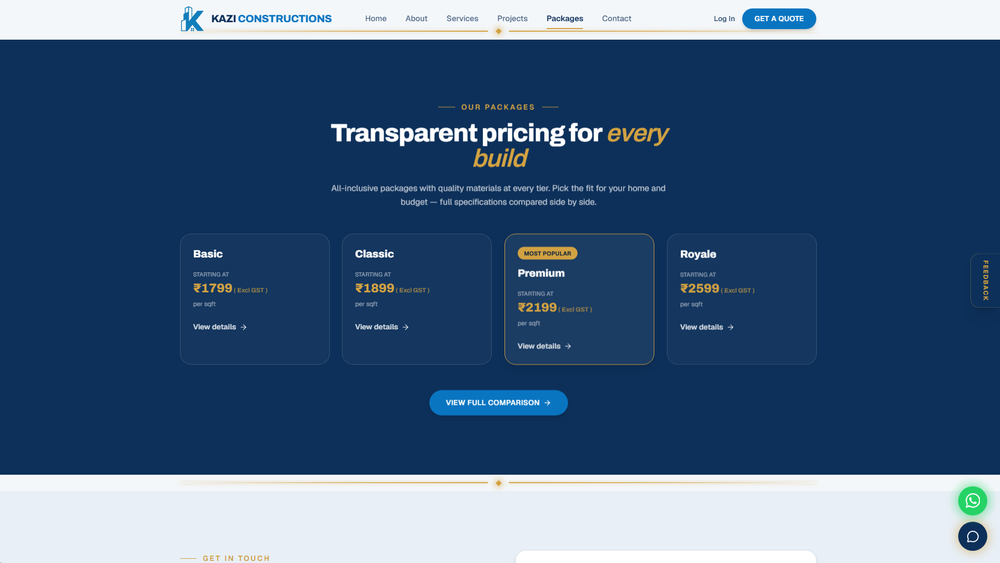

# Kazi Constructions - Official Website

> Building landmarks of enduring excellence since 2018. Professional construction, contracting, and engineering consultancy services in Hyderabad.

🌐 **Live Website:** [kazi-constructions.com] (https://kazi-constructions.com)

---

## 🏗️ About This Project

This is the official digital presence for **Kazi Constructions**, a trusted construction and engineering consultancy firm in Hyderabad with 10+ years of experience delivering residential, commercial, and industrial projects.

The website showcases the company's portfolio, services, and expertise through an interactive, modern web experience built with cutting-edge technologies.

---

## ✨ Key Features

### Public-Facing Features
- 🏠 **Interactive Hero Section** - Animated introduction with live company statistics
- 🎨 **3D Reality Slider** - Before/after comparison showcasing 6+ completed projects
- 📸 **Featured Projects Gallery** - Portfolio with 13+ projects across multiple categories
- 💰 **Package Comparison Tool** - Transparent pricing across 4 construction tiers
- 📱 **Lead Capture System** - Strategic popups and forms with automated email notifications
- ⏱️ **Counter Animations** - Dynamic statistics with smooth scroll-based animations
- 📧 **Contact Forms** - Multiple touchpoints for client inquiries
- 📱 **Fully Responsive** - Optimized across all devices

### Admin Dashboard
- 🔐 **Secure Authentication** - Firebase-powered login system
- 📊 **Lead Management** - Track and manage customer inquiries
- 📬 **Message Center** - View and respond to contact submissions
- 📂 **Document Management** - Upload and email documents to clients
- 🖼️ **Project Management** - Update project details and gallery images
- 📈 **System Diagnostics** - Monitor Firebase and SendGrid integration

---

## 🛠️ Tech Stack

### Frontend
- **Next.js 16** - React framework with App Router
- **TypeScript** - Type-safe development
- **Tailwind CSS** - Utility-first styling
- **Framer Motion** - Smooth animations
- **Radix UI** - Accessible component primitives

### Backend & Services
- **Firebase Authentication** - Secure admin login
- **Firebase Firestore** - Real-time database
- **Firebase Storage** - Document and image hosting
- **SendGrid** - Transactional email delivery
- **Google Workspace** - Custom email domain

### Deployment & Infrastructure
- **Vercel** - Serverless deployment platform
- **GitHub** - Version control
- **Custom Domain** - kazi-constructions.com

### Security & Compliance
- Security headers (X-Frame-Options, HSTS, CSP)
- File upload validation with magic byte verification
- URL sanitization and XSS prevention
- GDPR-compliant privacy policy
- Comprehensive terms of service

---

## 📸 Screenshots

### Hero Section

---

### 3D Design to Reality

---

### Featured Projects Gallery

---

### Transparent Pricing Packages

---

### Admin Dashboard

---

## 🌟 Project Highlights

- ✅ **10+ Years** of construction excellence
- ✅ **49+ Projects** successfully delivered
- ✅ **141+ Happy Clients** across Hyderabad
- ✅ **98% Client Satisfaction** rating
- ✅ Fully responsive design optimized for mobile, tablet, and desktop
- ✅ SEO-optimized with structured data markup
- ✅ Automated lead notification system
- ✅ Real-time admin dashboard with Firebase integration
- ✅ Enterprise-grade security and compliance

---

## 📞 Contact

**Kazi Constructions**
📧 Email: info@kazi-constructions.com
📱 Phone: +91-8801958508
🌐 Website: [kazi-constructions.com](https://kazi-constructions.com)
📍 Location: Hyderabad, Telangana

---

## 📄 License

© 2018-2026 Kazi Constructions. All rights reserved.

---

## 🚀 About the Developer

This project was designed and developed by **Badieuddin Habeeb Kazi**, using modern web development best practices with a focus on:

- **Performance** – Fast page loads and smooth interactions
- **Accessibility** – WCAG-compliant design patterns
- **Security** – Enterprise-grade protection layers
- **Scalability** – Built to handle growing business needs
- **User Experience** – Intuitive navigation and engaging animations

🔗 **LinkedIn:** https://www.linkedin.com/in/badieuddin-habeeb-kazi-1073262aa/

*For inquiries about this project or web development services, feel free to connect on LinkedIn or contact through the website.*
